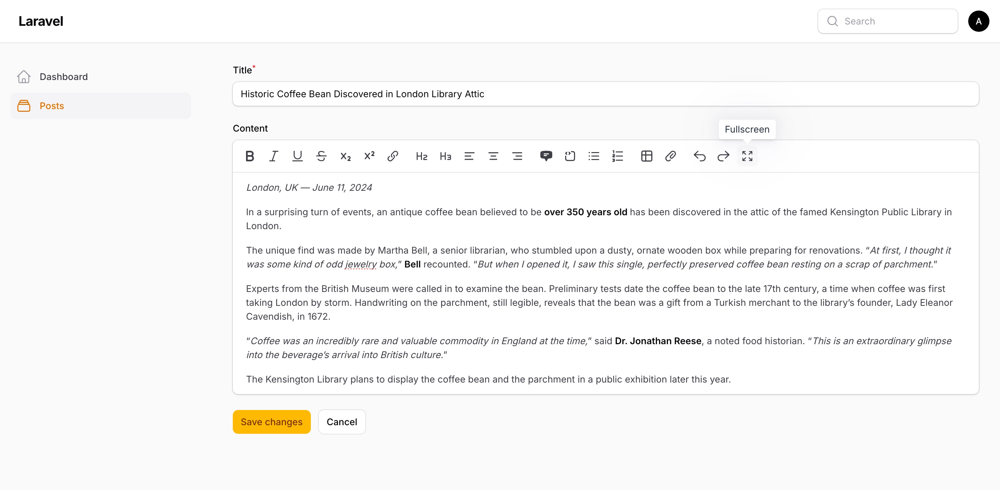

# Rich Editor Fullscreen

[](https://packagist.org/packages/mdobes/rich-editor-fullscreen)
[](https://packagist.org/packages/mdobes/rich-editor-fullscreen)

A Filament v4 plugin that adds fullscreen functionality to the Rich Editor component. This plugin allows users to expand the rich editor to fullscreen mode for a better writing experience.


## Installation

You can install the package via composer:

```bash
composer require mdobes/rich-editor-fullscreen
```

## Usage

Once installed, the fullscreen functionality is automatically available in all Rich Editor components. The plugin registers itself globally, so no additional configuration is needed.

### Basic Usage

The plugin automatically adds the fullscreen button to your Rich Editor toolbar:

```php
use Filament\Forms\Components\RichEditor;

RichEditor::make('content')
    ->toolbarButtons([
        'fullscreen',
    ])
```

### Keyboard Shortcuts

- `Cmd + Shift + F` (Mac) or `Ctrl + Shift + F` (Windows/Linux): Toggle fullscreen mode
- `Esc`: Exit fullscreen mode

## Screenshots

<picture>
  <source media="(prefers-color-scheme: dark)" srcset="img/editor-dark.jpg">
  <source media="(prefers-color-scheme: light)" srcset="img/editor-light.jpg">
  
</picture>

<picture>
  <source media="(prefers-color-scheme: dark)" srcset="img/full-dark.jpg">
  <source media="(prefers-color-scheme: light)" srcset="img/full-light.jpg">
  
</picture>


## Customization

### CSS Customization

You can customize the fullscreen appearance by publishing the assets and modifying the CSS:

```bash
php artisan vendor:publish --tag="rich-editor-fullscreen-assets"
```

The main CSS classes you can customize:

- `.fi-fo-rich-editor.fullscreen` - The main fullscreen container
- `.fi-fo-rich-editor.fullscreen .ProseMirror` - The editor content area
- `.fi-fo-rich-editor.fullscreen .fi-fo-rich-editor-toolbar` - The toolbar in fullscreen mode

## Changelog

Please see [CHANGELOG](CHANGELOG.md) for more information on what has changed recently.

## Contributing

Please see [CONTRIBUTING](CONTRIBUTING.md) for details.

## Security Vulnerabilities

Please review [our security policy](../../security/policy) on how to report security vulnerabilities.

## Credits

- [Michal Dobeš](https://github.com/mdobes)
- [All Contributors](../../contributors)

## License

The MIT License (MIT). Please see [License File](LICENSE.md) for more information.
